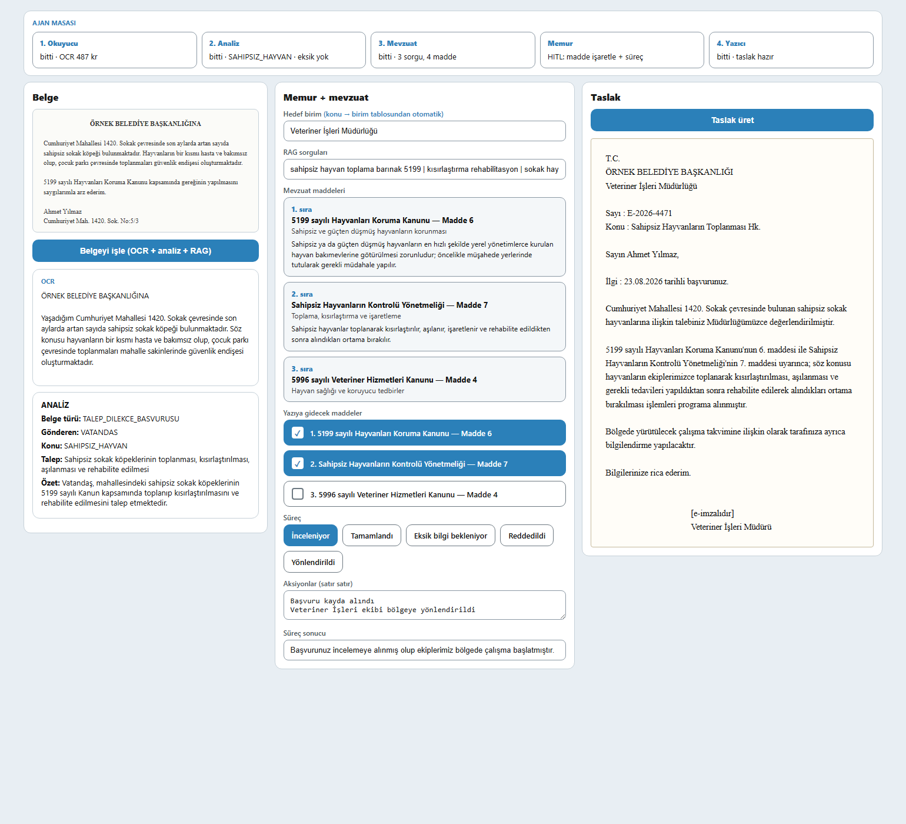

# KADİM: Kamu Dilekçe ve İnceleme Mekanizması

**Kamu evrak ve yazışma süreçleri için uçtan uca yapay zekâ ajan sistemi**

[](LICENSE)
[](https://www.python.org/)
[](https://huggingface.co/Qwen/Qwen2.5-7B-Instruct)
[](https://github.com/vllm-project/vllm)

> TEKNOFEST 2026 — Yapay Zeka Dil Ajanları Yarışması, 1. Senaryo: Kamu Evrak ve Yazışma Süreçleri.
> **Görev 1:** evrak sınıflandırma ve içerik analizi · **Görev 2:** resmî yazı taslaklama ve birim yönlendirme.

Belediyeye ulaşan bir dilekçe ya da kurum yazısı sisteme girer. Sistem belgeyi okur, içeriğini yapılandırılmış veriye çevirir, ilgili mevzuat maddelerini getirir, memurun kararını bekler ve son olarak resmî yazı taslağını üretir. Evrakın hangi müdürlüğe gideceğini model tahmin etmez; konu etiketi üzerinden sabit bir eşleme tablosuyla belirlenir.

```
Evrak görseli/metni → OCR → Analiz → Mevzuat → [ Memur kararı ] → Resmî yazı taslağı + hedef birim
```

---

## Öne çıkan sonuçlar

Üç dil modeli, projeye özgü verilerle LoRA yöntemiyle ince ayardan geçirildi. Bütün ölçümler eğitimde kullanılmayan sabit test kümeleri üzerinde yapıldı; ham model ile ince ayarlı model **aynı test kümesinde, aynı koşullarda** karşılaştırıldı.

| Modül | Ölçüt | Ham model | İnce ayarlı | Kazanç |
|---|---|---:|---:|---|
| OCR | Karakter hata oranı (CER) ↓ | 0,4283 | **0,1076** | hatanın **%75'i** giderildi |
| OCR | Türkçe karakter doğruluğu ↑ | %78,55 | **%85,90** | +7,35 puan |
| Analiz | `document_type` doğruluğu ↑ | %70,1 | **%85,5** | +15,4 puan |
| Analiz | `sender_type` doğruluğu ↑ | %78,0 | **%95,4** | +17,4 puan |
| Analiz | `missing_information` doğruluğu ↑ | %74,3 | **%97,9** | +23,6 puan |
| Yazıcı | `response_type` doğruluğu ↑ | %50,0 | **%82,18** | +32,2 puan |
| Mevzuat araması | İlk sırada isabet (H@1) ↑ | 59,5 | **69,0** | +9,5 puan |

Her modülün ölçüm ayrıntısı, kendi bölümünün sonundadır.

---

## İçindekiler

1. [Sistem Mimarisi ve Akış](#1-sistem-mimarisi-ve-akış)
2. [Depo Yapısı](#2-depo-yapısı)
3. [Modüller, Eğitim ve Sonuçlar](#3-modüller-eğitim-ve-sonuçlar)
4. [Veri Şeması](#4-veri-şeması)
5. [Kurulum ve Çalıştırma](#5-kurulum-ve-çalıştırma)
6. [Kullanılan Modeller ve Lisanslar](#6-kullanılan-modeller-ve-lisanslar)
7. [Etik, Veri Kullanımı ve Kaynaklar](#7-etik-veri-kullanımı-ve-kaynaklar)

---

## 1. Sistem Mimarisi ve Akış

Sistem, her biri tek bir işi üstlenen dört ajandan oluşur. Ajanların tam ortasında **insan-döngüde (HITL)** memur kararı vardır: model öneri üretir, memur onaylar.

```
   Evrak görseli / metni
             │
             ▼
 ┌────────────────────────┐
 │ 1) OKUYUCU  (OCR)      │  Qwen2.5-VL-7B + LoRA
 │    QWEN_VL_ocr/        │  →  ham metin
 └───────────┬────────────┘
             ▼
 ┌────────────────────────┐
 │ 2) ANALİZ  (Görev 1)   │  Qwen2.5-7B-Instruct + LoRA
 │    analiz_qwen1/       │  →  document_type, sender_type, primary_topic,
 └───────────┬────────────┘     requested_action, key_information,
             │                  missing_information, summary
             ▼
 ┌────────────────────────┐
 │ 3) MEVZUAT             │  Hibrit arama + yeniden sıralama
 │    mevzuat_rag/        │  →  ilgili kanun ve yönetmelik maddeleri
 └───────────┬────────────┘
             ▼
        ⏸  MEMUR KARARI      maddeleri işaretler · süreç durumunu seçer · not ekler
             │
             ▼
 ┌────────────────────────┐
 │ 4) YAZICI  (Görev 2)   │  Qwen2.5-7B-Instruct + LoRA
 │    yazi_qwen2/         │  →  performed_actions, response_type, process_status,
 └───────────┬────────────┘     result_information, process_information, draft
             ▼
   Hedef birim  =  primary_topic → müdürlük  (sabit eşleme tablosu)
```

Dört ajanı tek arayüzde birleştiren orkestratör ve Gradio demosu `app/` klasöründedir.

### Çalışma zamanı: vLLM ve çoklu LoRA

Eğitim Unsloth/TRL ile yapılır, canlı servis **vLLM** üzerinde çalışır. LoRA adaptörleri taban modele birleştirilmez; vLLM'in çoklu adaptör desteğiyle çalışma anında takılır:

| Motor | Model | Adaptör | Görev |
|---|---|---|---|
| 1 | Qwen2.5-VL-7B-Instruct | OCR LoRA | Görsel → metin |
| 2 | Qwen2.5-7B-Instruct | `analiz_lora` + `yazi_lora` | Metin → analiz JSON'u, JSON → resmî yazı |

Analiz ve yazı ajanları **aynı taban modeli** paylaşır; ikinci bir 7B model belleğe yüklenmez.

---

## 2. Depo Yapısı

```
belediye-evrak-ajani/
├── README.md                     # Bu dosya
├── LICENSE                       # MIT
├── requirements.txt              # Üst düzey bağımlılıklar
├── docs/
│   ├── demo_ekran.png            # Arayüz ekran görüntüsü
│   └── demo_onizleme_mock.html   # Statik arayüz önizlemesi
│
├── app/                          # ORKESTRATÖR + GRADIO DEMOSU
│   ├── notebooks/
│   │   └── Qwen1_RAG_Demo_Colab.ipynb   # Uçtan uca canlı demo
│   ├── src/                             # Notebook hücrelerinin okunabilir kaynak karşılıkları
│   │   ├── gradio_app.py                # Gradio arayüzü
│   │   ├── draft_prompt.py              # Yazıcı ajanın sistem prompt'u
│   │   ├── topic_map.py                 # Konu eşleme tablolarının yükleyicisi
│   │   └── vllm_worker.py               # vLLM çıkarım süreci
│   └── maps/
│       └── belediye_konu.json           # 58 konu → 11 müdürlük ve mevzuat anahtarları
│
├── QWEN_VL_ocr/                  # 1) OKUYUCU — OCR modeli
│   ├── download_dataset.py              # Kaynak metin kümesini indirir
│   ├── generate_dataset_1000.py         # 1000 sentetik belge görseli üretir
│   ├── qwen_ocr_baseline_test.ipynb     # Ham model ölçümü
│   ├── qwen_ocr_finetune_lora.ipynb     # LoRA eğitimi ve aynı testte ölçüm
│   └── data/                            # Her bozulma seviyesinden bir örnek (A/B/C/D)
│
├── analiz_qwen1/                 # 2) ANALİZ — Görev 1
│   ├── generate_dataset_*.py            # 11 müdürlük için sentetik evrak üretimi
│   ├── build_finetune_splits.py         # Eğitim/doğrulama/test ayrımı
│   ├── Qwen1_FineTune_Colab.ipynb       # LoRA eğitimi ve değerlendirme
│   └── veri/                            # Eğitim kümesinin tamamı
│       ├── train.jsonl · val.jsonl · test.jsonl
│       └── split_stats.txt              # Konu bazında dağılım
│
├── yazi_qwen2/                   # 4) YAZICI — Görev 2
│   ├── 01_finetune_qwen25_7b.ipynb      # LoRA eğitimi
│   ├── 02_evaluate_qwen25_7b.ipynb      # İnce ayarlı model değerlendirmesi
│   ├── 03_evaluate_base_model.ipynb     # Ham model değerlendirmesi
│   ├── augment_missing_types.py         # Nadir yanıt türlerinin dengelenmesi
│   ├── canonical_system_prompt.txt      # Yazıcı ajanın kanonik sistem prompt'u
│   └── veri/                            # Eğitim kümesinden temsilî örnek
│
└── mevzuat_rag/                  # 3) MEVZUAT — Arama motoru
    ├── requirements.txt
    └── rag/
        ├── search.py                    # Hibrit arama ve yeniden sıralama
        ├── config.py · scope.py · rerankers.py
        ├── embed/models.py              # Vektör temsilleri
        └── index/bm25.py                # Sözcük tabanlı arama
```

### Notebook'lar

| Dosya | İçerik |
|---|---|
| `QWEN_VL_ocr/qwen_ocr_baseline_test.ipynb` | Ham görsel-dil modelinin 100 belgelik test kümesindeki hata oranı |
| `QWEN_VL_ocr/qwen_ocr_finetune_lora.ipynb` | OCR LoRA eğitimi ve aynı test kümesinde ölçüm |
| `analiz_qwen1/Qwen1_FineTune_Colab.ipynb` | Analiz LoRA eğitimi ve 241 kayıtlık test |
| `yazi_qwen2/01_finetune_qwen25_7b.ipynb` | Yazıcı LoRA eğitimi |
| `yazi_qwen2/02_evaluate_qwen25_7b.ipynb` | Yazıcı ince ayarlı model — 522 kayıtlık test |
| `yazi_qwen2/03_evaluate_base_model.ipynb` | Yazıcı ham model — aynı 522 kayıt |
| `app/notebooks/Qwen1_RAG_Demo_Colab.ipynb` | Uçtan uca canlı demo |

---

## 3. Modüller, Eğitim ve Sonuçlar

Üç dil modeli eğitildi. Üçü de tam parametre eğitimi yerine **LoRA** ile, `Qwen/Qwen2.5-7B-Instruct` (OCR için `Qwen2.5-VL-7B-Instruct`) taban modeli üzerine, **bf16** hassasiyetle uyarlandı.

Her modülün ölçümü eğitimde kullanılmayan sabit bir test kümesi üzerinde, ham model ile ince ayarlı model **aynı kümede** karşılaştırılarak yapıldı.

### 3.1. Okuyucu — OCR · `QWEN_VL_ocr/`

**Amaç:** Türkçe belge görsellerinden metin çıkarmak.

**Veri:** Açık kaynaklı [`erdem-erdem/Turkish-Law-Documents-700k-clustered`](https://huggingface.co/datasets/erdem-erdem/Turkish-Law-Documents-700k-clustered) derlemesindeki düz metinler kullanıldı. Bu metinler Yargıtay ve Danıştay'ın kamuya açık karar arama sistemlerinden derlenmiştir. `generate_dataset_1000.py` her metni antetli bir belge sayfası olarak yeniden basar ve PNG'ye çevirir: 800 eğitim, 100 doğrulama, 100 test.

Gerçek tarama koşullarını temsil etmek için görseller dört bozulma seviyesine ayrılır ve her gruptan 250 belge üretilir:

| Grup | Tarama kalitesi | Örnek |
|---|---|---|
| A | Temiz baskı, bozulma yok | `QWEN_VL_ocr/data/A_0003.png` |
| B | Hafif bulanıklık, küçük kontrast kayması | `QWEN_VL_ocr/data/B_0077.png` |
| C | Belirgin bulanıklık, kontrast düşüşü, gürültü | `QWEN_VL_ocr/data/C_0065.png` |
| D | Düşük çözünürlük, ağır gürültü, eğrilik | `QWEN_VL_ocr/data/D_0064.png` |

**Yöntem:** Görsel kodlayıcı dondurulur; LoRA adaptörleri yalnızca dil modeli katmanlarına eklenir.

**Sonuç** — test kümesi: 100 belge görseli, 21.571 Türkçe karakter.

| Model | Karakter hata oranı (CER) ↓ | Türkçe karakter doğruluğu ↑ |
|---|---:|---:|
| Ham model | 0,4283 | %78,55 |
| **İnce ayarlı (LoRA)** | **0,1076** | **%85,90** |

İnce ayar, karakter hata oranını yaklaşık **dört kat** düşürdü. Kazanç en çok Türkçe'ye özgü harflerde (ı, ş, ğ, ö, ü, ç) görüldü: ham model bu harfleri sıklıkla ASCII karşılıklarına indirgerken, ince ayarlı model doğru üretiyor.

### 3.2. Analiz — Görev 1 · `analiz_qwen1/`

**Amaç:** Vatandaş ya da kurum başvurusunun ham metnini okuyup yapılandırılmış JSON'a çevirmek.

**Çıktı alanları:** `document_type`, `sender_type`, `primary_topic`, `requested_action`, `key_information`, `missing_information`, `summary`.

**Veri:** 11 müdürlük için ayrı ayrı yazılmış `generate_dataset_*.py` betikleri, her birimin kendi şemasına uygun sentetik evrak üretir. Toplam **2.444 evrak**, **58 konu**, **11 müdürlük**:

| Küme | Kayıt |
|---|---:|
| `train.jsonl` | 1.957 |
| `val.jsonl` | 246 |
| `test.jsonl` | 241 |
| **Toplam** | **2.444** |

Konu bazında dağılım `analiz_qwen1/veri/split_stats.txt` dosyasındadır. Veri üretiminde DeepSeek API'si kullanılır; anahtar `.env` dosyasından okunur ve depoya girmez.

**Sonuç** — test kümesi: 241 kayıt.

| Ölçüt | Ham model | İnce ayarlı (LoRA) | Kazanç |
|---|---:|---:|---|
| `document_type` doğruluğu | %70,1 | **%85,5** | +15,4 puan |
| `sender_type` doğruluğu | %78,0 | **%95,4** | +17,4 puan |
| `missing_information` doğruluğu | %74,3 | **%97,9** | +23,6 puan |

İnce ayarlı model ayrıca `primary_topic` alanında, 58 başlıktan oluşan konu taksonomisi üzerinde **%72,2** doğruluğa ulaşıyor.

`missing_information` doğruluğu, modelin evrakta eksik bilgi bulunup bulunmadığını doğru tespit etme oranıdır. Örneğin bir imar dilekçesinde ada veya parsel numarası yoksa modelin bunu eksik olarak işaretlemesi beklenir. En büyük kazanç bu alanda görüldü.

### 3.3. Yazıcı — Görev 2 · `yazi_qwen2/`

**Amaç:** Analiz JSON'unu, memurun seçtiği süreç durumunu ve onaylanan mevzuat maddelerini alarak idari aksiyonları, yanıt türünü, süreç bilgisini ve **resmî yazı taslağını** üretmek.

**Veri:** ChatML biçiminde toplam **5.625 kayıt** — 4.240 eğitim, 863 doğrulama, 522 test.

**Bir evraktan çok senaryo (1→N):** Gerçek idari hayatta aynı başvuru farklı süreç durumlarına düşebilir ve her durum farklı bir resmî yazı gerektirir. "İncelemede", "eksik bilgi bekleniyor", "yönlendirildi", "reddedildi" ve "tamamlandı" durumlarının her biri için ayrı bir yazı yazılır. Bu nedenle her analiz kaydı farklı süreç durumlarıyla eşlenerek birden çok eğitim örneğine açıldı. Yazıcı kümesinin (5.625) analiz kümesinden (2.444) büyük olmasının sebebi budur; model böylece aynı evrakın duruma göre nasıl farklı yazıldığını öğrenir.

**Mevzuata dayanma ve halüsinasyon direnci:** Kayıtların yaklaşık %85'inde model, kendisine verilen mevzuat maddelerine doğrudan atıf yapar. Kalan %15'inde madde listesi bilinçli olarak boş bırakılır. Böylece model, ilgili mevzuat bulunamadığında **madde uydurmak yerine** genel idari usule uygun bir yazı üretmeyi öğrenir.

**Eğitim kümesindeki dağılım:**

| `response_type` | Adet | | `process_status` | Adet |
|---|---:|---|---|---:|
| EKSIK_BILGI_BELGE_TAMAMLAMA_YAZISI | 1.127 | | EKSIK_BILGI_BEKLENIYOR | 1.127 |
| BILDIRIM_YAZISI | 727 | | TAMAMLANDI | 944 |
| BILGI_YAZISI | 709 | | INCELEMEDE | 849 |
| YONLENDIRME_YAZISI | 631 | | YONLENDIRILDI | 688 |
| RET_YAZISI | 478 | | REDDEDILDI | 632 |
| ONAY_YAZISI | 315 | | | |
| TESPIT_TUTANAGI | 253 | | | |

Nadir kalan yanıt türleri `augment_missing_types.py` ile dengelendi. Modelin uyduğu resmî yazışma kurallarının tamamı `yazi_qwen2/canonical_system_prompt.txt` dosyasındadır.

**Sonuç** — test kümesi: 522 kayıt.

| Model | Notebook | `response_type` doğruluğu ↑ |
|---|---|---:|
| Ham model | `03_evaluate_base_model.ipynb` | %50,0 |
| **İnce ayarlı (LoRA)** | `02_evaluate_qwen25_7b.ipynb` | **%82,18** |

İnce ayar, doğru yazı türünü seçme başarısını **+32,2 puan** artırdı. Ham model vakaların ancak yarısında doğru türü seçebilirken, ince ayarlı model kurum pratiğine uygun türü büyük çoğunlukla isabet ettiriyor.

### 3.4. Mevzuat Arama Motoru · `mevzuat_rag/`

**Amaç:** Başvuruyla ilgili kanun ve yönetmelik maddelerini bulup memura sunmak.

Motor, kamuya açık mevzuat metinlerini madde düzeyinde indeksler ve üç aşamada çalışır:

1. **Anlamsal arama** — BGE-M3 vektör temsilleriyle, sorguyla aynı anlama gelen maddeler bulunur.
2. **Sözcük tabanlı arama** — BM25 ile kanun adı, madde numarası gibi birebir eşleşmeler yakalanır.
3. **Birleştirme ve yeniden sıralama** — İki listenin sonuçları RRF ile birleştirilir ve BGE-reranker-v2-m3 ile yeniden sıralanır.

Arama sorgusu iki parçadan oluşur: analiz ajanının belirlediği konunun mevzuat dilindeki karşılığı ve başvurunun talep cümlesi (`requested_action`).

**Sonuç** — test kümesi: 126 kavramsal sorgudan oluşan sabit bir referans kümesi. Tüm koşular aynı sorgular üzerinde, tek seferde tek değişken değiştirilerek yapıldı.

| Koşu | Vektör modeli | H@1 ↑ | H@3 ↑ | H@5 ↑ | MRR ↑ | Kaçırma ↓ |
|---|---|---:|---:|---:|---:|---:|
| Taban | BGE-M3 | 59,5 | 84,1 | 92,9 | 0,729 | 6 |
| **Üretim** | **BGE-M3 + sıralama düzeltmesi** | **69,0** | **86,5** | **92,9** | **0,789** | **4** |
| Alternatif | multilingual-e5-large + sıralama düzeltmesi | 70,6 | 84,9 | 91,3 | 0,792 | 6 |

Konuyla yalnızca yüzeysel örtüşen maddeleri geriye iten **sıralama düzeltmesi**, ilk sıradaki isabeti 59,5'ten **69,0**'a çıkardı ve hiç sonuç bulunamayan sorgu sayısını 6'dan 4'e indirdi.

Aynı koşullarda denenen `multilingual-e5-large` yalnızca H@1'de 1,6 puan öndeydi; H@3, H@5 ve kaçırma sayısında geride kaldı.Bundan dolayı BGE-M3 modeli kullanıma alındı. 

### 3.5. Birim Yönlendirmesi

**Hedef müdürlük model tahminine bırakılmaz.** Analiz ajanının belirlediği `primary_topic` etiketi, `app/maps/belediye_konu.json` dosyasındaki sabit eşleme tablosu üzerinden bir müdürlüğe karşılık gelir. 58 konu, 11 müdürlüğe eşlenmiştir: İmar ve Şehircilik, Fen İşleri, Zabıta, Çevre Koruma ve Kontrol, Temizlik İşleri, Veteriner İşleri, Sosyal Yardım İşleri, Park ve Bahçeler, Mali Hizmetler, Hukuk İşleri, Yazı İşleri.

Böylece yönlendirme kararı deterministik, tekrarlanabilir ve denetlenebilir olur; modelin var olmayan bir birim üretmesi mümkün değildir.

---

## 4. Veri Şeması

### 4.1. Analiz ajanının çıktısı

Bu JSON aynı zamanda yazıcı ajanın girdisidir; memurun seçtiği süreç durumu ve işaretlediği mevzuat maddeleri eklenerek iletilir.

```json
{
  "document_type": "ITIRAZ_IDARI_BASVURU",
  "sender_type": "VATANDAS",
  "primary_topic": "TEBLIGAT_ISLEMLERI",
  "requested_action": "2024/128 sayılı encümen kararının tebligatının yeniden yapılması",
  "key_information": [
    {"type": "PERSON", "value": "Ali Veli"},
    {"type": "DOCUMENT_NO", "value": "2024/128"},
    {"type": "REFERENCE_NO", "value": "E-2025-1142"}
  ],
  "missing_information": [],
  "summary": "Ali Veli, encümen kararı tebligatının usulsüz olduğunu belirterek yeniden tebliğ talep etmektedir.",
  "process_status": "INCELEMEDE",
  "selected_legislation": [
    {
      "law_name": "3071 sayılı Dilekçe Hakkının Kullanılmasına Dair Kanun",
      "article": "Madde 7",
      "reference_text": "..."
    }
  ]
}
```

### 4.2. Yazıcı ajanının çıktısı

```json
{
  "performed_actions": [
    {"action": "BASVURU_KAYDI", "detail": "Başvuru E-2025-1142 numarasıyla kaydedilmiştir."},
    {"action": "EVRAK_INCELEMESI", "detail": "İlgili karar ve tebligat mazbatası incelenmeye başlanmıştır."}
  ],
  "target_unit": "Yazı İşleri Müdürlüğü",
  "response_type": "BILGI_YAZISI",
  "process_status": "INCELEMEDE",
  "result_information": "Başvurunuz incelemeye alınmıştır; süreç değerlendirmesi devam etmektedir.",
  "process_information": "Başvuru kayıtlı olup tebligat usulü incelemesi sürmektedir.",
  "draft": "T.C.\nBELEDİYE BAŞKANLIĞI\nYazı İşleri Müdürlüğü\n\nSayı: E-2025-1142\nKonu: Tebligat İşlemleri Hk.\n\nSayın Ali Veli,\n...\nBilgilerinize rica ederim."
}
```

### 4.3. İzin verilen değerler

Model bu listelerin dışında değer üretemez.

- **`response_type` (7):** `BILGI_YAZISI`, `BILDIRIM_YAZISI`, `EKSIK_BILGI_BELGE_TAMAMLAMA_YAZISI`, `RET_YAZISI`, `YONLENDIRME_YAZISI`, `TESPIT_TUTANAGI`, `ONAY_YAZISI`
- **`process_status` (5):** `INCELEMEDE`, `TAMAMLANDI`, `EKSIK_BILGI_BEKLENIYOR`, `REDDEDILDI`, `YONLENDIRILDI`
- **Bağlayıcı kural:** `process_status` değeri `EKSIK_BILGI_BEKLENIYOR` ise `response_type` mutlaka `EKSIK_BILGI_BELGE_TAMAMLAMA_YAZISI` olur.

---

## 5. Kurulum ve Çalıştırma

### 5.1. Bağımlılıklar

```bash
python -m venv .venv
source .venv/bin/activate    # Windows: .venv\Scripts\activate
pip install -r requirements.txt
```

Hazır eğitim kümeleri depoda bulunduğundan veri üretimi zorunlu değildir. Yeni sentetik veri üretmek isterseniz DeepSeek API anahtarı gerekir:

```bash
cp analiz_qwen1/.env.example analiz_qwen1/.env
```

### 5.2. Veri üretimi (isteğe bağlı)

```bash
cd analiz_qwen1
python generate_dataset_imar.py       # ve diğer 10 müdürlük betiği
python build_finetune_splits.py       # → veri/train|val|test.jsonl
```

```bash
cd QWEN_VL_ocr
python download_dataset.py
python generate_dataset_1000.py --dataset_path ./turkish_law_dataset --output_dir ./dataset_1000
```

### 5.3. Eğitim

Notebook'lar sırayla çalıştırılır:

1. `QWEN_VL_ocr/qwen_ocr_baseline_test.ipynb` → `QWEN_VL_ocr/qwen_ocr_finetune_lora.ipynb`
2. `analiz_qwen1/Qwen1_FineTune_Colab.ipynb`
3. `yazi_qwen2/01_finetune_qwen25_7b.ipynb` → `02_evaluate_qwen25_7b.ipynb` (ham model karşılaştırması için `03_evaluate_base_model.ipynb`)

### 5.4. Uçtan uca demo

Canlı sistem `app/notebooks/Qwen1_RAG_Demo_Colab.ipynb` notebook'u ile çalıştırılır; GPU'lu bir ortam gerekir. `app/src/gradio_app.py`, aynı arayüzün okunabilir kaynak karşılığıdır. Notebook sonunda paylaşılabilir bir Gradio bağlantısı açılır.

**Belediye Evrak Masası arayüzü** — solda belge, ortada memur kararı ve mevzuat maddeleri, sağda üretilen taslak:



Statik önizleme: `docs/demo_onizleme_mock.html`.

---

## 6. Kullanılan Modeller ve Lisanslar

Şartnamenin 7. bölümü uyarınca üçüncü taraf model ağırlıkları depoya yüklenmez; erişim bağlantısı, sürüm ve lisans bilgisi burada belirtilir.

| Bileşen | Erişim | Lisans |
|---|---|---|
| `Qwen/Qwen2.5-7B-Instruct` — analiz ve yazı taban modeli | [Hugging Face](https://huggingface.co/Qwen/Qwen2.5-7B-Instruct) | Apache-2.0 |
| `Qwen/Qwen2.5-VL-7B-Instruct` — OCR taban modeli | [Hugging Face](https://huggingface.co/Qwen/Qwen2.5-VL-7B-Instruct) | Apache-2.0 |
| `BAAI/bge-m3` — vektör temsili | [Hugging Face](https://huggingface.co/BAAI/bge-m3) | MIT |
| `BAAI/bge-reranker-v2-m3` — yeniden sıralama | [Hugging Face](https://huggingface.co/BAAI/bge-reranker-v2-m3) | Apache-2.0 |
| Bu projede eğitilen üç LoRA adaptörü | Notebook çıktısı olarak üretilir | MIT |

**Depoda bulunanlar:** tüm kaynak kod, eğitim ve değerlendirme notebook'ları, sentetik veri üretim betikleri, analiz eğitim kümesinin tamamı, yazıcı eğitim kümesinden temsilî örnek, OCR veri kümesinden dört örnek görsel, sistem prompt'ları, eşleme tabloları ve Gradio arayüzü.

**Depoda bulunmayanlar:** model ağırlıkları, LoRA adaptörleri, üretilmiş arama indeksi ve tam boyutlu veri arşivleri. Bunların tamamı depodaki betik ve notebook'larla yeniden üretilebilir.

---

## 7. Etik, Veri Kullanımı ve Kaynaklar

**Lisans:** MIT — bkz. [LICENSE](LICENSE).

**Veri kullanımı.** Şartname gereği gerçek kamu evrakı kullanılmamıştır:

- **Görev 1 ve 2:** DeepSeek API'si ile üretilmiş kurgu dilekçeler ve resmî yazışma taslakları.
- **OCR:** Hugging Face üzerindeki açık derlemeden alınan, kamuya açık yargı kararı metinleri. Bu metinler antetli sayfa olarak yeniden basılmıştır; depodaki görseller taranmış resmî evrak değil, eğitim için üretilmiş sentetik belge görüntüleridir.
- **Mevzuat:** Kamuya açık kanun ve yönetmelik metinleri.

Hiçbir veri kümesinde gerçek kişisel veri (TCKN, ad, adres, telefon) yer almaz; tüm örnekler sentetiktir.

**Üçüncü taraf lisansları.** Kullanılan tüm modeller ve kütüphaneler kendi lisans koşullarına uygun biçimde kullanılmaktadır; ayrıntı için bkz. [6. bölüm](#6-kullanılan-modeller-ve-lisanslar).

**Kaynaklar**

- Qwen2.5 ve Qwen2.5-VL — Alibaba Cloud
- vLLM — çalışma zamanı çıkarım motoru
- BGE-M3 ve BGE-reranker-v2-m3 — BAAI
- OCR kaynak metinleri — [`erdem-erdem/Turkish-Law-Documents-700k-clustered`](https://huggingface.co/datasets/erdem-erdem/Turkish-Law-Documents-700k-clustered); birincil kurumlar [Yargıtay Karar Arama](https://karararama.yargitay.gov.tr/) ve [Danıştay Karar Arama](https://kararara.danistay.gov.tr/)
- Sentetik evrak üretimi — DeepSeek API
